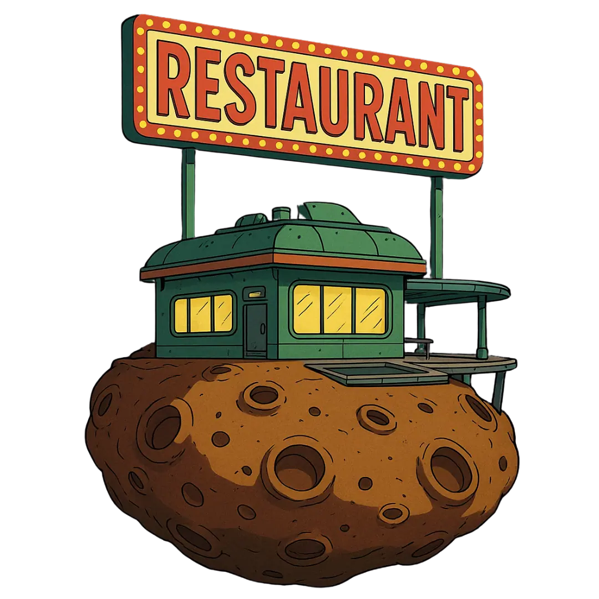

# Cosmic Chaos Adventure

A sci-fi adventure web app where users create unique space travelers by answering personality questions, explore absurd interactive stories, and mint their characters as NFTs.

{width=500 height=500}

## About This Project

Cosmic Chaos Adventure is a unique narrative experience inspired by the works of Douglas Adams, combining the absurd humor of The Hitchhiker's Guide to the Galaxy with RPG decision-making and Web3 technology.

**Key Features:**
- 🧠 **Personality Test:** Answer quirky questions to generate your unique cosmic character
- 🚀 **Interactive Stories:** Embark on absurd adventures across the universe with your character
- 🎭 **Character Development:** Collect artifacts and develop your character's statistics
- 🌌 **Cosmic Aesthetic:** Immerse yourself in a visually stunning cosmic universe
- 🔄 **Bilingual Support:** Experience the adventure in both English and Spanish
- 🌐 **Web3 Integration:** Mint your character and artifacts as NFTs (coming soon)

## Project Info

**URL**: https://lovable.dev/projects/377d927b-165f-41bd-b95c-5c7a2b2e2584

## Technology Stack

This project is built with:

- **Frontend Framework:** React with TypeScript
- **Build Tool:** Vite
- **Styling:** Tailwind CSS with custom cosmic theme
- **UI Components:** shadcn-ui with custom cosmic components
- **Animations:** Custom particle effects and typewriter animations
- **State Management:** Zustand for global state
- **Internationalization:** i18next for multi-language support
- **API Integration:** React Query (TanStack Query)

## Getting Started

Follow these steps to run the project locally:

```sh
# Step 1: Clone the repository
git clone <YOUR_GIT_URL>

# Step 2: Navigate to the project directory
cd cosmic-chaos-adventure/front

# Step 3: Install the necessary dependencies
npm i

# Step 4: Start the development server
npm run dev
```

## Project Structure

- `/src/components` - Reusable UI components
- `/src/pages` - Main application pages
- `/src/hooks` - Custom React hooks
- `/src/lib` - Utilities, API services, and store
- `/src/locales` - Translation files for multiple languages
- `/public` - Static assets including images

## Roadmap

We have exciting plans for the future of Cosmic Chaos Adventure:

- **Multi-Character Narratives:** Create and manage multiple characters in the same universe
- **Quick Play Mode:** Short, randomized adventures for players with limited time
- **Artifact Marketplace:** Trade your collected cosmic artifacts with other players
- **Character Marketplace:** Buy, sell, or trade unique character NFTs
- **Enhanced Web3 Integration:** Full blockchain support for all digital assets
- **Mobile App:** Native mobile experience for on-the-go cosmic adventuring
- **Community Features:** Forums, character sharing, and custom adventure creation

## How to Contribute

We welcome contributions to Cosmic Chaos Adventure! Here's how you can help:

1. Fork the repository
2. Create a feature branch (`git checkout -b feature/amazing-feature`)
3. Commit your changes (`git commit -m 'Add some amazing feature'`)
4. Push to the branch (`git push origin feature/amazing-feature`)
5. Open a Pull Request

## Deployment

Simply open [Lovable](https://lovable.dev/projects/377d927b-165f-41bd-b95c-5c7a2b2e2584) and click on Share -> Publish to deploy the latest version of the project.

## License

This project is licensed under the MIT License - see the LICENSE file for details.

## Acknowledgments

- Douglas Adams for the inspiration
- The D&D community for narrative mechanics
- Web3 innovators for the future of digital ownership

## How can I edit this code?

There are several ways of editing your application.

**Use Lovable**

Simply visit the [Lovable Project](https://lovable.dev/projects/377d927b-165f-41bd-b95c-5c7a2b2e2584) and start prompting.

Changes made via Lovable will be committed automatically to this repo.

**Use your preferred IDE**

If you want to work locally using your own IDE, you can clone this repo and push changes. Pushed changes will also be reflected in Lovable.

The only requirement is having Node.js & npm installed - [install with nvm](https://github.com/nvm-sh/nvm#installing-and-updating)

Follow these steps:

```sh
# Step 1: Clone the repository using the project's Git URL.
git clone <YOUR_GIT_URL>

# Step 2: Navigate to the project directory.
cd <YOUR_PROJECT_NAME>

# Step 3: Install the necessary dependencies.
npm i

# Step 4: Start the development server with auto-reloading and an instant preview.
npm run dev
```

**Edit a file directly in GitHub**

- Navigate to the desired file(s).
- Click the "Edit" button (pencil icon) at the top right of the file view.
- Make your changes and commit the changes.

**Use GitHub Codespaces**

- Navigate to the main page of your repository.
- Click on the "Code" button (green button) near the top right.
- Select the "Codespaces" tab.
- Click on "New codespace" to launch a new Codespace environment.
- Edit files directly within the Codespace and commit and push your changes once you're done.

## Can I connect a custom domain to my Lovable project?

Yes, you can!

To connect a domain, navigate to Project > Settings > Domains and click Connect Domain.

Read more here: [Setting up a custom domain](https://docs.lovable.dev/tips-tricks/custom-domain#step-by-step-guide)
